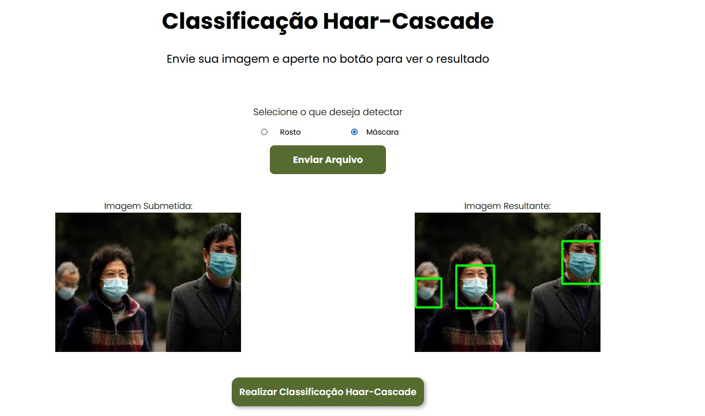

# Classificador Haar-Cascade para detecção de Rostos
## Daniel Andre Marinho e Mateus Simeão

Este projeto implementa um **classificador Haar-Cascade** para **detecção de rostos**, baseado no tutorial disponível em [Tutorial de Classificadores Haar-Like](https://github.com/felipecbarelli/livro-visao-computacional/blob/master/tutoriais/creating-a-cascade-of-haar-like-classifiers.pdf). O classificador é treinado para detectar rostos em imagens e foi aplicado utilizando o **OpenCV** para o processamento das imagens e a detecção.
A interface gráfica foi implementada em **Angular** para permitir a interação do usuário com o sistema através de um frontend.

### Treinamento
- O treinamento foi realizado seguindo as instruções [Tutorial](https://github.com/felipecbarelli/livro-visao-computacional/blob/master/tutoriais/creating-a-cascade-of-haar-like-classifiers.pdf) disponibilizado como material para desenvolvimento do projeto.
- Foram utilizadas imagens positivas de rostos e imagens negativas de ambientes aleatórios em preto e branco.
- O arquivo resultante do classificador foi salvo como o XML [myfacedetector.xml](https://github.com/mateussimeao/haar-cascade-classifier/blob/main/backend/assets/myfacedetector.xml), que será utilizado posteriormente para realizar as detecções.

### Aplicação
- O classificador treinado é utilizado através de uma [aplicação backend Flask em python do **OpenCV**](https://github.com/mateussimeao/haar-cascade-classifier/blob/main/backend/haar-training.py), processando a imagem em tom de cinza e realizando a detecção de rostos através das funções AplicarClassificador() e MostrarImagemComDeteccoes().

### Exibição dos Resultados
- Uma interface front-end foi desenvolvida em **Angular** para permitir que o usuário carregue imagens e visualize os rostos detectados.
- A interação com o back-end é feita por meio de chamadas HTTP, onde as imagens processadas são enviadas para o servidor local e retornadas com as detecções visíveis.

- Para executar o classificador é nécessario acessar a pasta de frontend e executar a aplicação.
- `cd frontend` para entrar no diretório do front-end
- `npm install @angular/cli@17` para instalar o angular
- `npm install` para instalar o pacote node_modules e dependências
- `ng serve` ou `npm start` para executar o front-end
- Em seguida a partir do diretório raiz do repositório deve ser acessado o backend e executar o arquivo [haar-training.py](https://github.com/mateussimeao/haar-cascade-classifier/blob/main/backend/haar-training.py).
- `cd backend` para ir ao diretório da aplicação Flask. Em seguida, aperte no botão de executar.

#### Demonstração da aplicação:

## Atualização: Detecção de Máscaras Faciais

Agora o projeto inclui a funcionalidade de **detecção de máscaras faciais** em rostos. Esta nova funcionalidade pode ser ativada por meio de um **checkbox** na interface de usuário, permitindo detectar automaticamente se uma pessoa está utilizando máscara facial nas imagens ou vídeos processados.

### Como Usar:
- Ative a opção de **detecção de máscaras** selecionando o checkbox correspondente.
- Ao ativar esta opção, o classificador Haar Cascade treinado irá detectar máscaras faciais em alguma imagem de sua escolha enviada para aplicação através do upload de um arquivo local.

Essa nova funcionalidade complementa a detecção de rostos já existente no sistema e pode ser usada para casos de controle ou monitoramento de uso de máscaras.

- ### Observação:
    - Ainda estão ocorrendo diversos casos de falsos positivos e erros em detecções. A adição de novas imagens negativas no processo de treinamento ajudou a atenuar esses problemas, mas falsos positivos ainda persistem. Continuamos buscando melhorias para aumentar a precisão do classificador e minimizar esses erros.

Essa nova funcionalidade complementa a detecção de rostos já existente no sistema e pode ser usada para casos de controle ou monitoramento do uso de máscaras.

